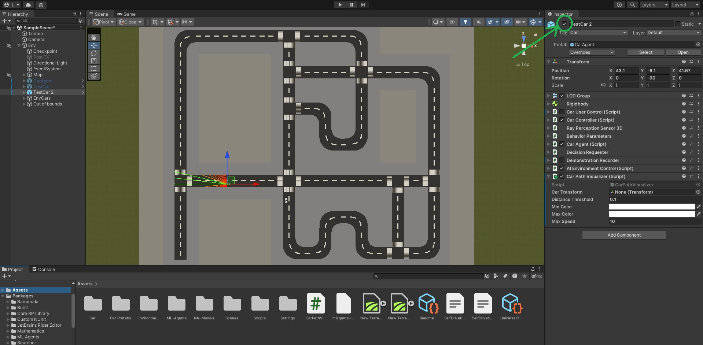

# Self-Driving Agent Project

## Overview
This project implements a self-driving agent within a Unity simulation environment using ML-Agents. The agent learns to navigate through various scenarios such as turns, junctions, and obeying traffic lights. The project utilises curriculum learning to gradually increase task complexity and enhance the agent's capabilities.

## Usage

### Running the Project

#### 1. Install Unity
   - Download and install Unity Hub from the [official Unity website](https://unity.com/).
   - Open Unity Hub and navigate to the "Installs" tab.
   - Click "Add" to add a new Unity version.
   - Select the Unity version 2022.3.10f1 and install it.

#### 2. Open the project
   - Open the project in Unity Hub by selecting the project folder "Car Simulation".

#### 3. Install ML-Agents (Not necessary if included)

##### Option 1: Using Unity Package Manager
   - Open the Unity project editor.
   - Go to `Window` -> `Package Manager`.
   - Search for "ML Agents" in the Package Manager window.
   - Click on "Install" to add ML-Agents to your project.

##### Option 2: Using pip (Alternative method)
   - Ensure you have Python installed on your system. You can download Python from the [official Python website](https://www.python.org/).
   - Install ML-Agents by running the following command in your terminal or command prompt:
     ```
     pip install mlagents==2.0.1
     ```

## Using ML-Agents in Unity Project

### Activating/Deactivating Cars in Unity Project

1. **Open Unity Editor:**
   - Open the project in the Unity Editor.

2. **Navigate to Hierarchy Window:**
   - In the Unity Editor, locate the "Hierarchy" window.

3. **Activate/Deactivate Cars:**
   - In the "Hierarchy" window, find the game objects representing the cars you want to activate or deactivate.
   - To activate a car, make sure the corresponding game object is enabled (checkbox is checked).
   
   - To deactivate a car, disable the corresponding game object (uncheck the checkbox).

- The **CarAgent** is the car used for training and follows the training path. Under the behaviour parameters it is set to default behaviour type for training and does not use a neural model for its behaviour.

- The **TestCar** is the car testing the models and also follows the training path. Under the behaviour parameters it is set to inference behaviour type for uses a neural model given for its behaviour.

- The **TestCar2** is the car testing the models and follows the testing path. It also has an inference behaviour type for uses a neural model given for its behaviour.

   - Note: The neural models are not all compatible with the training cars as they have a difference in neural network structure. The final policy is given by the "AllCars" model under Assets/NN-Models if not already included. This model should be dragged to the "Model" parameter under the "Behavior Parameters" of the desired car.

- Under **EnvCars** are the environment cars. These can be selected or deselected as desired and are categorised by the 8 different routes.

### Starting Training 

If you want to train your own agent in the environment these are the steps to follow.

1. **Define The Agent Class:**
   - In the agent script given in "Assets/Scripts/CarAgent", define the inputs, observations and reward system as desired.

2. **Open Terminal/Command Prompt:**
   - Navigate to the directory of the project.

3. **Activate Python Virtual Environment (if applicable):**
   - Activate a python virtual environment using:
     ```
     source venv/bin/activate   # For Linux/Mac
     venv\Scripts\activate      # For Windows
     ```

4. **Start Training:**
   - Run the following command to start training the ML-Agents:
     ```
     mlagents-learn Assets/SelfDrivePPO.yaml --run-id=YourRunID
     ```
   - This command will start training the self-driving agent using the specified configuration file (SelfDrivePPO.yaml).

### Viewing Results Using TensorBoard

#### Downloading TensorBoard

- If you don't have TensorBoard installed, you can install it following the instructions on www.tensorflow.org/install

1. **Open Terminal/Command Prompt:**
   - Navigate to the directory of the project.

2. **View Training Progress:**
   - Run the following command to start TensorBoard and visualize the training progress:
     ```
     tensorboard --logdir=results
     ```
   - This command will start TensorBoard server, allowing you to view training statistics and graphs in your web browser.

3. **Access TensorBoard in Web Browser:**
   - Open your web browser and navigate to the URL provided by TensorBoard in the command window (usually http://localhost:6006).
   - You can explore various training metrics, graphs, and visualisations to monitor the training progress and performance of the agent.

### Customisation
You can customise the training environment, agent behaviour, and hyperparameters to suit your specific requirements. 

### Folder Structure

#### Assets
The "Assets" folder contains all the assets used in the Unity project, including models, textures, scripts, and scenes.

#### demos
The "demos" folder contains demonstrations used for imitation learning in ML-Agents.

#### results
The "results" folder contains output results generated from the agent's training.

###### Library
The "Library" folder is automatically generated by Unity and contains metadata and other files used during development. It's recommended not to modify or include this folder in version control (the git repository: github.com/lukeguppy/Deep-RL-Final-Project).

###### Logs
The "Logs" folder stores training logs generated during the ML-Agents training process.

###### obj
The "obj" folder typically contains intermediate files generated during the build process. It can be automatically regenerated by Unity.

###### Packages
The "Packages" folder contains external packages and dependencies used in the Unity project. This includes the ML-Agents package.

###### ProjectSettings
The "ProjectSettings" folder stores project-specific settings and configurations, such as input settings, physics settings, and editor preferences.

###### Temp
The "Temp" folder is used by Unity to store temporary files during the build process. It's safe to delete this folder as it can be regenerated by Unity.

###### UserSettings
The "UserSettings" folder stores user-specific settings and configurations, such as layout preferences and editor window positions.

###### venv
The "venv" folder typically contains a Python virtual environment used for managing project-specific Python dependencies and packages. It's commonly used in Python-based projects for dependency isolation and reproducibility.
